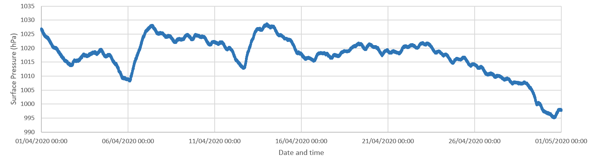
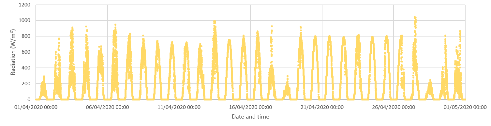
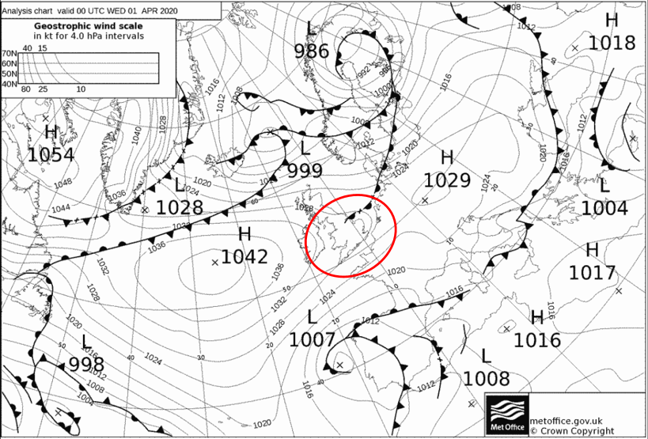
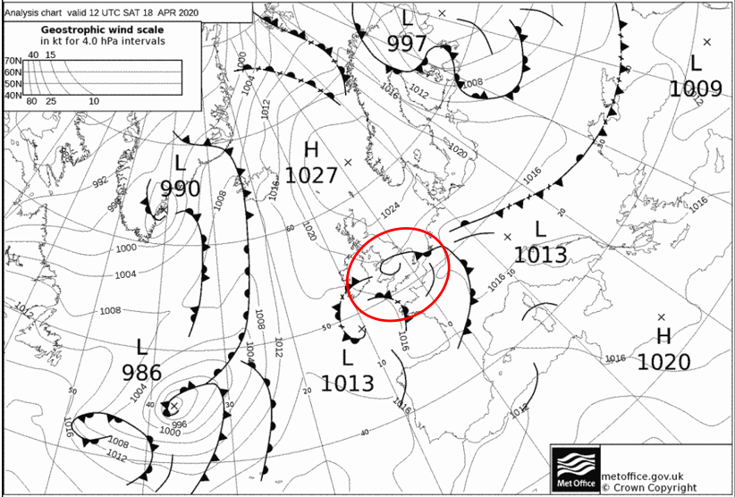
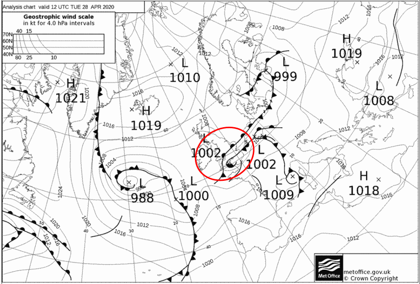

April has now been [announced](https://www.metoffice.gov.uk/about-us/press-office/news/weather-and-climate/2020/2020-april-stats) as the UK’s sunniest April on record by the Met Office recording approximately 172% of April sunshine compared to the long term average (1981-2010). It was also reported to be an extremely dry month with most areas of the UK reporting below average rainfall for the time of year. 

As mentioned in the last blog post found [here](./joys-of-april), Birmingham also received similarly dry and warm conditions for much of April predominantly due to persistent high pressure situated over the UK. 

Looking at our data from the Elms cottage meteorological site located at the University of Birmingham campus, it can be seen that surface pressure levels were also relatively high for much of the month. The exception to this was during the last week of April when a series of low pressure systems swept in from the west bringing heavy showers at times. 

However, looking at the radiation levels received, even these low pressure systems towards the end of the month did not affect Birmingham too much with plenty of sunshine still received. The daily rise and fall in values is due to the sun rising and setting with no radiation received during the night time hours.

The 1st, 18th and 28th of the month recorded lower radiation levels due to the passing over of warm fronts which are often associated with cloudier conditions through the lifting of warm, moist air. 

In total for the month of April our Elms cottage site on the UoB campus received 8,118,553 W/m² of radiation. 