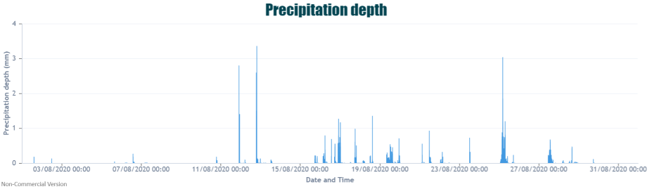

The start of meteorological autumn is now here, however some may say it arrived early with the end of August being particularly cooler than usual.

When looking at the temperatures from our Elms Cottage University of Birmingham campus site we can evidently see the extended heatwave period experienced within the second week of August. During this there were six days consecutively recording maximum temperatures in the high 20’s and low 30s. The maximum temperature recorded during this heatwave was on the 12th August with 33.7°C.

As mentioned, the last week, including the Bank Holiday weekend (typical!) was unseasonably cool with maximum temperatures only reaching a peak of 17.24 °C.

During this colder streak the surface pressure charts show high pressure situated to the west of the UK with a cold northerly flow moving in, an indication of what brought those temperatures down.

We also had two named storms through August – Storm Ellen which passed over the UK on the 19-22nd August and then following this, Storm Francis 24th–26th August. Both of these brought widespread flooding and strong winds. 

For wind speeds we can see that the maximum speeds (in green) were particularly high across the 26th August with a max speed of 31.61 m/s (70.71mph). Even the average wind speeds (blue) during this period were particularly fast, with speeds of around 4-8 m/s (~9-18mph)

As we had some technical issues with our campus rain gauge recently the precipitation values below are from the Moseley School site. Looking at precipitation depth we can see that we had plenty of rain across Birmingham through the month, particularly towards the latter half as those named storms hit the UK. A total of 117.81mm was recorded, well above average for August, with ~66mm usually expected in Birmingham. 

From the surface pressure graphs we can almost see a tale of two halves across August with the first half of the month showing fairly consistent high pressure, yet within the latter half there is a noticeable overall drop as low pressure moved in from across the Atlantic.

The impact of the frontal clouds associated with the storms can even be seen having an impact on the solar radiation levels with both the 19th and 26th August receiving low levels of solar radiation. 

Finally, if we remember back towards the end of the second week in August we had some incredible lightning displays across the Midlands. At one of our city centre sites, the Thinktank, the sensor picked up a total of 897 lightning strikes through the month with 42 of those occurring over just a 5 minute period on 12th August. 

Summer is now over and unfortunately we had a dreary ending. Considering the year so far, I am sure we can expect some surprises from the coming autumn.