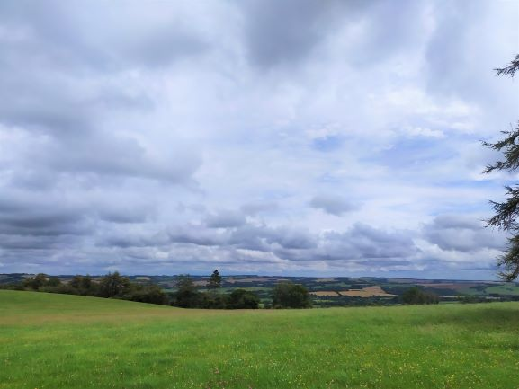
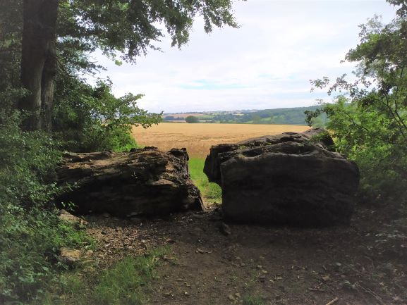
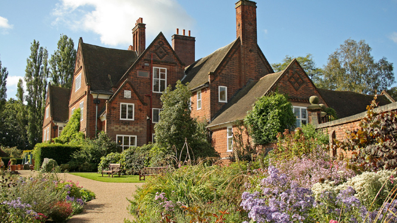

&nbsp;

##<i>Did you know the Midlands has one of the UK’s longest standing meteorological records?</i>

&nbsp;

#The Midlands and the origin of the first observations

The Midlands typically encaptures an area across the middle of England (hence the name) with topography likened to a shallow bowl where the central point, Birmingham, is situated on a slightly elevated plateau. Its limits – the Peak District, the Welsh hills, the Staffordshire moorlands and the Cotswolds all represent more hilly regions surrounding the Midlands. Although, like the rest of the UK, the Midlands climate is dominated by a maritime air mass, its position is slightly sheltered from the incoming Atlantic lows by the Welsh topography. However, with three major rivers running through it – the Severn, Trent and Avon – it has not been without major flooding events, particularly in more recent years. 

It is thanks to a squire of Lyndon Hall in Rutland from whom we can claim we have long standing meteorological records. Thomas Barker kept weather records for a number of stations across England, including Birmingham. It is noted that he recorded barometric pressure, temperature, clouds, wind and rainfall all of which continue to be popular features monitored by modern day meteorological stations.  

&nbsp;

#Development of observations

As the popularity for weather observations increased, stations began to pop up in more areas of the UK too. Members of the Lunar Society in Birmingham built their own stations and began taking and noting measurements on a regular basis in April 1793. Further interest in meteorology grew and several other organisations began to take their own measurements also. 

When the Met Office became established increased routine and regimented observations began and the World Meteorological Organisation (WMO) began to set standards for the ‘correct’ way to take meteorological measurements. Within Birmingham the main meteorological station became the Winterbourne weather station, located at the Winterbourne House and Gardens – a beautiful Botanical garden located on the University of Birmingham campus. 

However, the beauty of these gardens were to be the met stations downfall. As interests in the gardens grew the weather station became less of a priority and it was eventually moved out of the area.

&nbsp;

#Present day

This leads us to present day. Fortunately the Winterbourne station was re-located just over the road and re-named Winterbourne 2, however we more commonly refer to it as the Elms Cottage station. Elms Cottage marks the location for both the Met Office station and our own University of Birmingham campus site station. 

Our site takes a reading every minute for numerous observations from mean sea level pressure and air temperature to rainfall and lightning strikes! All of our data from our Elms Cottage site can be found on our website (look for the bright pink dot!) alongside a multitude of other high accuracy weather stations and hundreds of citizen science weather stations located all across Birmingham and the nearby surroundings.  

Monitoring the weather is vital for a number of important applications, not to mention it is a popular conservation topic for us Brits! So we can thank scientists and weather enthusiasts like Thomas Barker and the Birmingham Lunar Society for giving the Midlands some of the longest standing (and continuing) weather observation recordings in the UK.

&nbsp;

For more information on the Midlands, Birmingham and weather records:

•	<a href="https://books.google.co.uk/books?hl=en&lr=&id=NSCDCF0VGnsC&oi=fnd&pg=PA111&dq=(Giles+and+Kings,+1997&ots=aKCJL8LOjO&sig=vib1ar4EnxLLYscY_1KX4RFKnRI&redir_esc=y#v=onepage&q&f=false">Regional Climates of the British Isles (Giles and Kings, 1997)</a>

•	<a href="http://www.bebirmingham.org.uk/uploads/Birmingham%20Climate%20Portfolio(3).pdf">Birmingham Climate Portfolio

