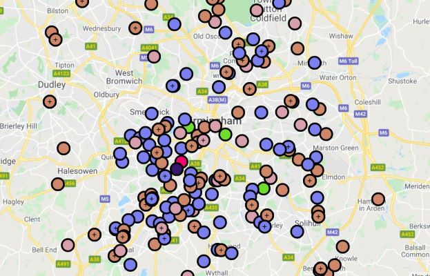

Here at Birmingham Urban Observatory we have been fortunate enough to acquire 25 air quality monitors. This consists of five E-Motes, created by [Envirowatch](http://www.envirowatch.ltd.uk/e-mote/) and 20 Zephyr monitors, created by [Earthsense](https://www.earthsense.co.uk/zephyr). Both types of sensors are battery powered with the Zephyrs also including a solar panel for extra power requirements. In addition to this, both types of monitors use their own wireless communication methods meaning they have the freedom to be used in any location. 

Our aim is to ultimately have these AQ monitors installed all across Birmingham measuring the air quality and providing the information on our website, which already has a number of environmental observations on it, for all to see: https://birminghamurbanobservatory.com/.

Due to current restrictions and the processes involved, we are not quite at that stage yet, however we will be sure to update you when this does happen. 

On the other hand, we do currently have one installed outside of our School of Geography building on the University of Birmingham campus. This Zephyr sensor has been giving us measurements for Nitrogen Monoxide (NOx), Nitrogen Dioxide (NO2), Ozone (O3), PM1, PM 2.5 and PM 10, all of which contribute to poor air quality. All of its observations can be found on our webpage here: https://data.birminghamurbanobservatory.com/map/platforms?platform=geography-building-lamp-post.

Hopefully over the next few months, more of these will be installed across Birmingham offering us a network of air quality observations across the city and giving you the opportunity to check and monitor these values too.  