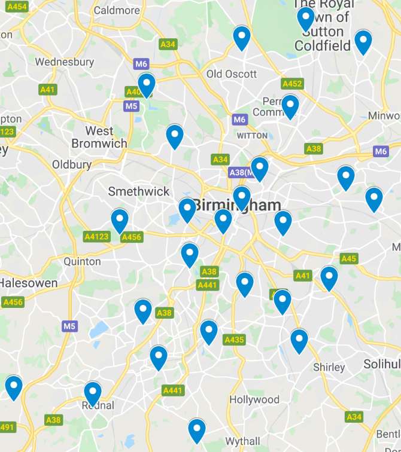

We have been working hard alongside Campbell Scientific to get brand new compact digital weather sensors - [ClimaVUE50 weather stations](https://www.campbellsci.com/climavue-50) - installed at a number of locations across Birmingham. These solar powered stations feature a temperature sensor, an anemometer, a pyranometer, a relative humidity sensor and a rain gauge to name just a few instruments. 

The map below shows the distribution of these sites, with some still to be installed. We are fortunate enough to have created a good spread of stations across the city, allowing us to see the differences, or similarities, in the weather across different areas of Birmingham. Once completed, we should have 25 separate sites all monitoring the meteorological conditions and changes. 

We are hoping, with continual monitoring of the sites, to take long-term observations across all seasons. This can then be used to compare to a low-cost weather sensor network we are developing, alongside a number of other valuable uses. 

Here are the past 24 hour observations for the current live stations. Can you see the weather for your area?

Name | Area | Link to Data
---  | ---  | ---
Allens Croft | Kings Heath	| https://app.konectgds.com/kiosk/6fc0af4a-3493-4f91-8a44-4110bf906997
Bell Heath |	Belbroughton	| https://app.konectgds.com/kiosk/028e5f6d-7369-4f5a-9855-1f4ee6a532d1
Chilcote |	Hall Green/Haslucks Green	| https://app.konectgds.com/kiosk/fc0a00a1-5529-41d5-80da-7d6bfaaeff3c
Colebourne |	Hodge Hill	| https://app.konectgds.com/kiosk/674f5ddc-d997-47aa-bc48-fadf61eadce3
Donkey Sanctuary |	Sutton Park	| https://app.konectgds.com/kiosk/646a2398-0418-4d53-b1d9-5c91f23b801c
Elms Cottage AWS |	University of Birmingham	| https://app.konectgds.com/kiosk/c8c55446-9283-4acc-94c1-4a2ff81b6186
Featherstone |	Erdington	| https://app.konectgds.com/kiosk/6a9294dc-181c-47aa-9c59-506c151d142f
Forge Mill |	Sandwell Valley	| https://app.konectgds.com/kiosk/43c3a951-35e6-4f0a-88a0-1b16fb279647
Holy Cross |	Walmley	| https://app.konectgds.com/kiosk/ff2b28eb-dfde-458c-995b-069e8d32d7c2
Kingsland J&I School |	Kingstanding	| https://app.konectgds.com/kiosk/28e01fbe-f5dd-4e90-9aa0-4c4bd277decf
Lea Forest |	Lea Hall	| https://app.konectgds.com/kiosk/dd895250-4caf-4792-8086-fe459c80f9ee
Moseley C of E School |	Moseley	| https://app.konectgds.com/kiosk/c919bae0-05c4-424a-ba57-2e4ab1af2afe
Mount Pleasant School Farm |	Forhill	| https://app.konectgds.com/kiosk/42b3b669-8941-407b-af4d-365a1c91af2d
Rednal |	Rednal	| https://app.konectgds.com/kiosk/53738435-f52e-4af6-a8f4-a81af8b8aaa6
Somerville |	Small Heath	| https://app.konectgds.com/kiosk/0575d17b-e935-4769-8839-a05b36bff487
St Catherines |	City Centre	| https://app.konectgds.com/kiosk/50906d63-7624-49ad-ab02-ae43a288f281
St Josephs Catholic Primary School |	Nechells	| https://app.konectgds.com/kiosk/f8863ed4-4dbd-49d6-a50f-af4a8f40acb7
The Oratory |	Ladywood	| https://app.konectgds.com/kiosk/5e0e2379-506f-484e-b033-47aca2dc2805
Wychall Primary School |	Northfield	| https://app.konectgds.com/kiosk/5c4a0a4d-ddba-4fa2-8577-4cfd860ea9d1
		

