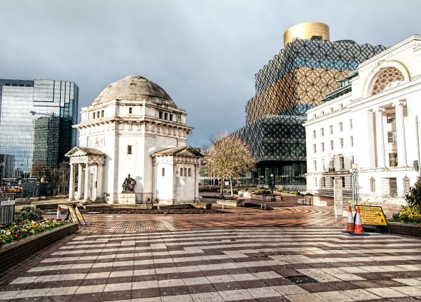
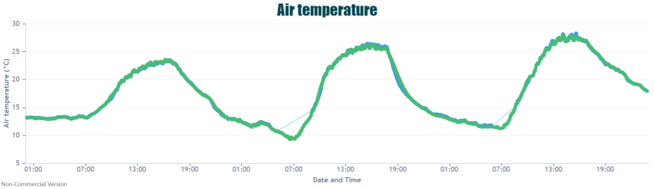
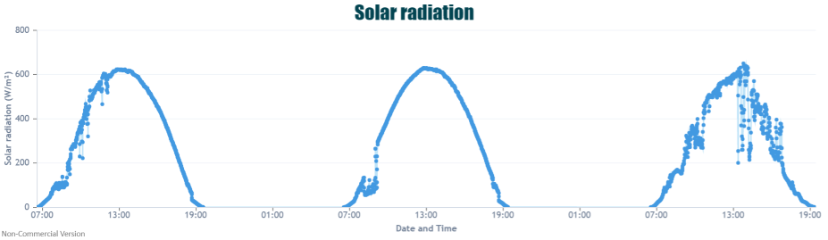
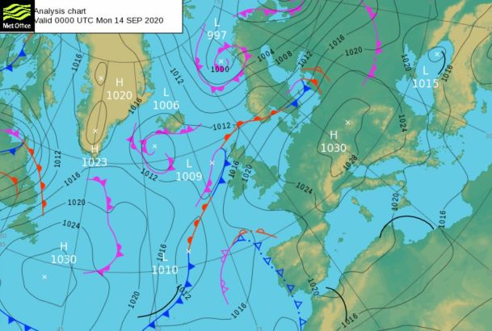

An Indian Summer is often a phrase used to describe a period of unusual late warmth experienced during the Autumn months. Although it is more commonly associated with the later Autumn months of October and November, it can also be used to describe unseasonable heat felt during September. 

Over the past few days I am sure you have noticed that it has been warmer than usual. Across Birmingham temperatures have risen widely to the mid-20’s during the afternoon heat. The peak was felt on Tuesday when 28.06°C was recorded at our Elms Cottage campus weather station. However Sunday and Monday were also particularly warm with temperature topping out around 23.63°C and 26.31°C respectively.

Sunshine levels were also high as largely clear skies were present across Birmingham, alebit we did have some foggy starts during the morning and solar radiation levels dropped on Tuesday afternoon as clouds rolled in. 

These warm temperatures were driven by the location of high pressure to the east of the UK, with warmer air moving up from the continent and calm winds adding to the development of heat. The UK was also situated within the warm sector of a notherly low pressure system – the region of the frontal system where warmer air lies. 

The current records for the warmest days in October and November are reported as being the 1st October 2011 where 29.9°C was recorded in Gravesend, Kent and the 1st November 2015 where 22.4°C was recorded in Trawsgoed, Ceredigion. It is interesting to note that both of these records were recorded on the first day of each month!

So after our first Indian Summer period happening early on in the Autumn this year, it will be interesting to see if we have any more episodes later on. It has been an interesting year weather-wise so I am sure the wonderful Great British weather has some more in store for us!
