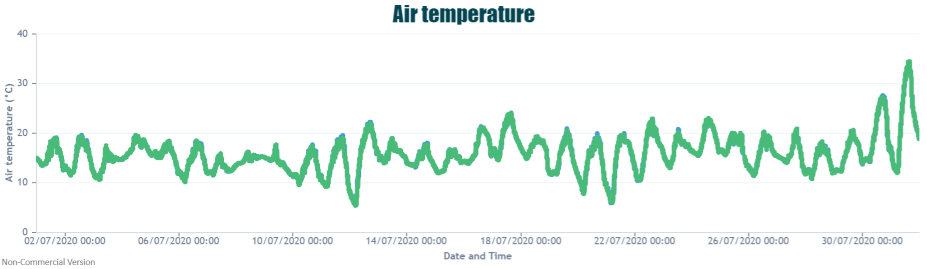
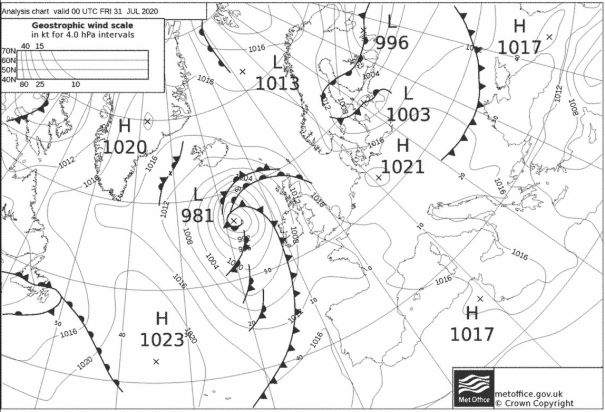
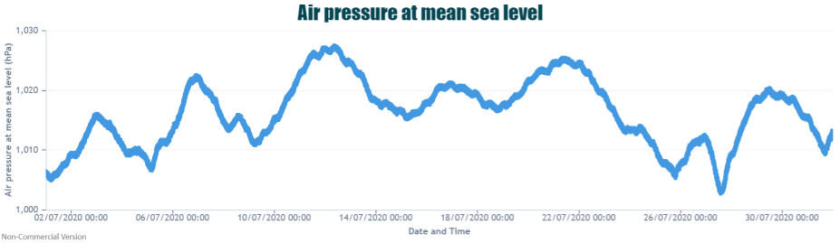
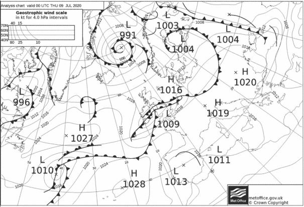
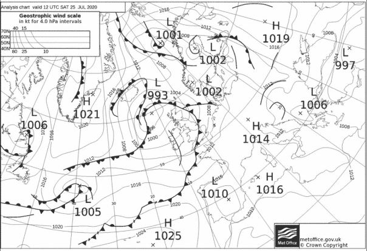
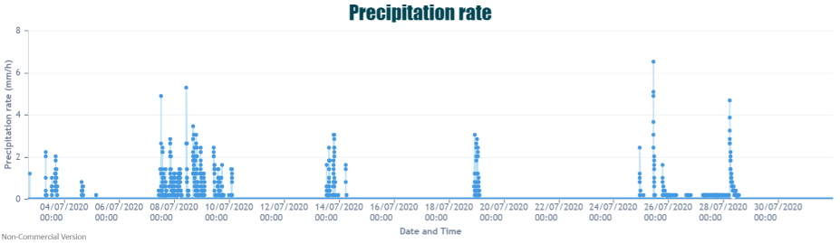
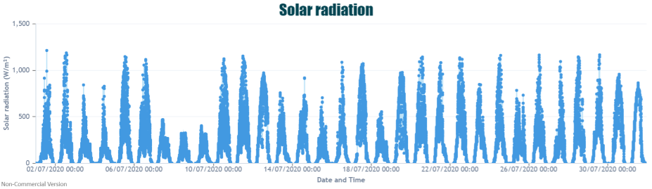

With July we entered the second half of the year and the middle of British summertime. However, for much of the time it almost felt like we had already entered Autumn with colder spells and plenty of overcast, grey days. 

Looking at our Elms Cottage meteorological site, located on the University of Birmingham campus we can see that in general night-time temperatures were reasonably mild, with just a few nights seeing temperatures drop below 10°C. 

Particularly towards the latter half of the month there were a few warmer days where maximum temperatures rose over 20°C, finally giving the feeling of a true summer’s afternoon. 

The stand out (and probably most memorable) feature of July also occurred at the end of the month when we experienced extreme warmth and high temperatures on the 31st. On this day the UK recorded its warmest day of the year so far with 37.8°C observed at Heathrow, the UKs 3rd hottest day on record ever. Similarly we also recorded our hottest day of the year so far at our Birmingham site with temperatures topping out at 34.48°C. 

The surface pressure charts for this day show high pressure situated to the east of the UK with warm southerly air flowing northwards across the UK.

Surface pressure for Birmingham was a mixed bag with some longer periods of high pressure being broken down by brief passing low pressure systems coming in from the Atlantic.

Examples of these low pressure systems can be seen below. 

These low pressue systems often brought with them rain, particularly within the second week of July. 

Although we did have some sunnier, brighter days through July the general trend was less than average sunshine levels. From the solar radiation data recorded at Elms Cottage you can see that there were a number of days when Birmingham did receive high solar radiation levels, but on the contrary we also had several days with low values coinciding with those grey, overcast days. 

So in summary July was a fairly grey month for Birmingham however, thanks to the final day of the month we did record our hottest day of the year so far. 

Currently forecasts are saying that although we may see some warmer, brighter, drier spells in the first few weeks of August, however there is a chance it may become more unsettled towards the end of the month. As a whole, 2020 has been an incredibly strange year, and that means for the weather too. 

