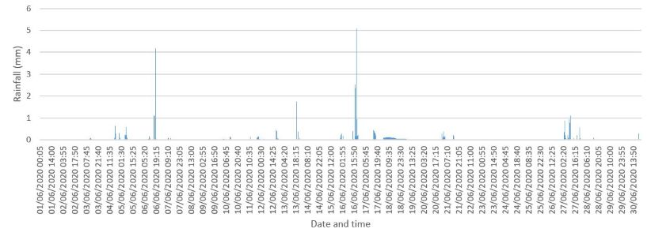

Compared to the calm, dry May we had earlier this year, June has provided us with much more unsettled, and often unpredictable, weather. From intense thundery downpours to extreme heat it has truly been a rollercoaster of weather phenomenon. 

Unfortunately due to technical issues at the University of Birmingham’s meteorological station our Elms Cottage site is missing several days of data through June. Due to this we are instead looking at the data collected from another one of our stations, located at St Catherine’s of Siena Primary School, whose positioning within the city centre will provide a good outlook on the weather within inner city Birmingham. You can view St Catherine’s live data at this link: https://app.konectgds.com/kiosk/50906d63-7624-49ad-ab02-ae43a288f281

When considering this June’s temperatures, the recent heatwave period between 24th to the 26th comes to mind. With temperatures across of our Birmingham weather stations reaching the high 20’s around this period, the St Catherine’s site actually pushed into the low 30s on both the 24th and 25th of June with maximum temperatures of 30.88 °C and 31.78 °C respectively. 

It is interesting to note that our Elms cottage meteorological site which is located on the University of Birmingham campus, a couple of miles out from the city centre, recorded a maximum of 30.57°C on the 25th June. The slightly warmer temperature maxima recorded from St Catherine’s demonstrates the influence of the Urban Heat Island effect and how inner city regions are often warmer than their outer surroundings. 

The average temperature across the whole month taking into account both daytime and night time was 15.56°C however, this would have been a lot lower without the heatwave period. 

Throughout June we did experience a few chillier days and nights, particularly when we had low pressure systems moving in from the west. This can be demonstrated in the surface pressure charts on the 06/06/2020 which show low pressure situated over the UK and colder air moving in from the north. 

The pressure values for St Catherine’s also shows a dip around this time indicating the presence of a low pressure system. There is also a noticeable drop in pressure following the heatwave period around the 27th when high pressure to the east of the UK shifted further eastwards allowing low pressure to regain an influence over the UK weather. 

With May being a record breaking dry month, June actually saw its fair share of rain. With plenty of thundery showers and a few periods of more consistent frontal rain the St Catherine’s site recorded a total of 105mm rain. 

We also experienced a windy June, especially as those low pressure systems drifted over. 

For the St Catherine’s site the highest winds were recorded on the 11th June and then towards the end of June between the 28th and 29th. Looking at the surface pressure charts we can see that this was due to the presence of low pressure with the tight isobars indicating high wind speeds. 

June on the 25th with a maximum of 33.3°C recorded at Heathrow when much of the country experienced an extreme heatwave. 

Looking forward, July is seeming to remain reasonably unsettled so far but there have been predictions that later in the month we could see some calmer, warmer weather so do not dismiss the chance for another heatwave and plenty of BBQ’s quite just yet!
