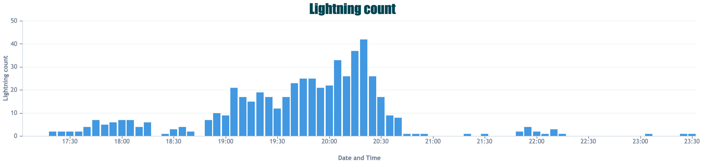

From past experience we know that following intense heat and warmth we often experience thunderstorms in the UK. Over the past few days we have seen plenty of lightning strikes, providing some spectacular views across Birmingham and its surroundings. 

The graph below shows the number of strikes detected every 5 minutes by our [Thinktank weather station](https://data.birminghamurbanobservatory.com/plot?ancestorPlatforms__includes=thinktank&observedProperty=lightning-count&unit=count&start=2020-08-12T15:00:55.000Z&end=2020-08-12T22:00:55.000Z) on the evening of the 12th August. In just 5 minutes, between 8:15pm and 8:20pm, 42 strikes were recorded in the vicinity!

# But what is lightning?

Thunderstorms and lightning are commonly associated with those big, tall cumulonimbus clouds and are the result of instability within the atmosphere. Within these clouds, hail and ice crystals form. As they move around and collide with each other, electrons are displaced producing a build-up of both negatively-charged and positively-charged particles. The lighter, positively charged ice crystals are lifted to the top of the cloud whilst heavier, negatively charged hail sinks to the lower parts. Eventually, when the difference becomes too large, a charge will propagate between the two in the form of lightning. This can be a cloud-to-cloud strike, a cloud-to-air strike or a cloud-to-ground strike. 

The lightning is the visual display of this charge and the thunder which follows is the noise created by it. This noise is due to the fast expansion of the air nearby as it is heated rapidly. As light travels faster than sound, this explains why we will see lightning before we hear it. 

# Where can I see where lightning strikes are occurring? 

As lightning storms tend to occur more frequently in hotter regions, in between the tropics tend to experience the highest frequency of lightning strikes. 
However as I am sure you are aware we can also get them here in the UK, particularly in the warmer months. 

At the University of Birmingham we are currently in the process of installing a lightning detector on our library roof. This BTD-200 Lightning Warning System will detect any lightning strike occurrences up to a 35km (22 miles) distance from the sensor which will cover a large area of Birmingham and the surroundings. Keep an eye on our [website](https://birminghamurbanobservatory.com/) to keep up to date with when this happens. 

For the time being however, an interesting website is [Blitzortung](https://www.blitzortung.org/en/live_lightning_maps.php). Described as a ‘worldwide, real time, community and collaborative lightning location network’, it shows live lightning strikes on a world map as they occur. 

For a more UK specific outlook, the Met Office have a [real time observations map](https://www.metoffice.gov.uk/public/weather/observation/map/#?map=Lightning&fcTime=1597283100&zoom=7&lon=-0.70&lat=52.25) which can show you recent lightning strikes across the country.

However, for some over the next few days, the best place to see lightning strikes may be outside your own window!

