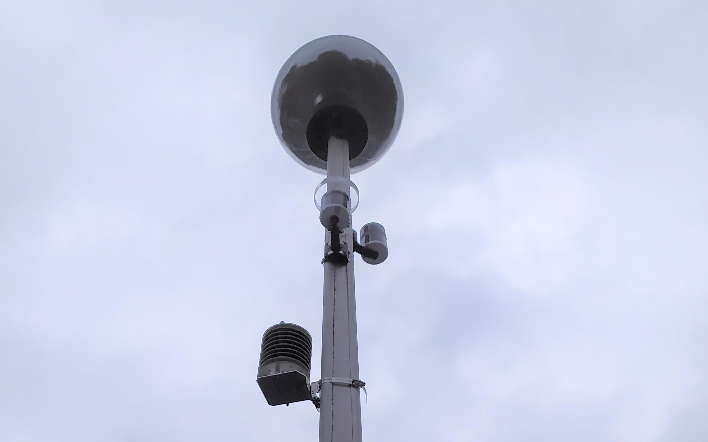
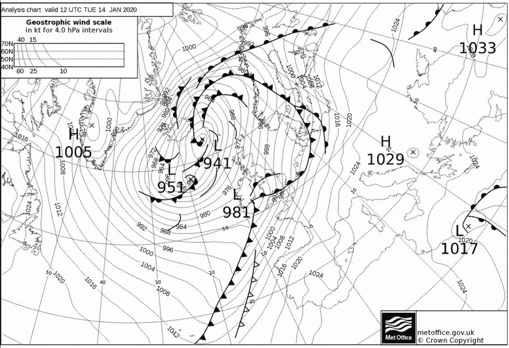
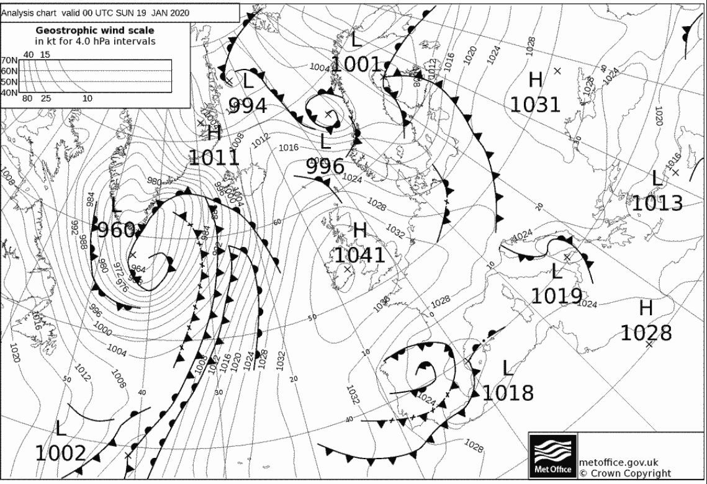

This graph compares the January temperature values for both the Elms Cottage meteorological site we have here on the University of Birmingham campus and a low cost weather station, [Netatmo](https://www.netatmo.com/en-gb/weather), we have installed at Chad Vale School, located just a 5 minute drive from the campus. 

Within January, although there was a peak in temperatures around the 8th January, the warmest day for both stations was recorded on the afternoon of the 14th January. With this, the Elms site recorded a high of 12.69°C at 16:17 in the afternoon and the Chad Vale site recorded a similar value of 12.4°C at 16:09, 16:11, 16:12 and 16:17 – just 0.3°C less. It is worth noting that at the Elms site the temperature is recorded to two decimal places whereas the Netamo takes it to just one decimal place which will affect the data. Measurement timings are also different with Elms taking a measurement every minute and the Netatmo supposedly every ~5 minutes however, we can see from these values that this is even more sporadic than expected. 

The surface pressure charts for midday on the 14th January show a warm front beginning to sweep up the UK which is what caused those warmer temperatures during the afternoon. However, the cold front swiftly followed closely behind indicating why these milder temperatures did not last.

Considering the lowest temperatures of the month, there is an evident drop in temperature around the 19th/20th and 21st of January. This is due to high pressure which positioned itself over the UK and Ireland during this period and pulled cold, Arctic air down over the North Sea and across the UK. High pressure systems, commonly referred to as anti-cyclones often have calm, clockwise moving winds and settled conditions. 

During this dominant high pressure situation both the Elms Site and Chad Vale site recorded their minima on the morning of the 19th January. For the Elms site the minimum was recorded at 8:28am, just as everyone was heading to or starting work, with a value of -2.35°C. The Chad Vale also recorded its minima in the morning at 08:20, 08:25 and 08:30 although it was not as cold as the Elms site with a value of -1.9°C.

Overall for January it was reasonably mild with the Met Office naming it as one of the top 10 warmest Januarys on record. With just three mornings recording values below 0 degrees Celsius it was highly unlikely that the residents of Birmingham spent much time de-icing their cars this January. Although there were discrepancies in the exact temperatures between the Elms site and Chad Vale site, overall the timings were similar and these differences were slight. 
