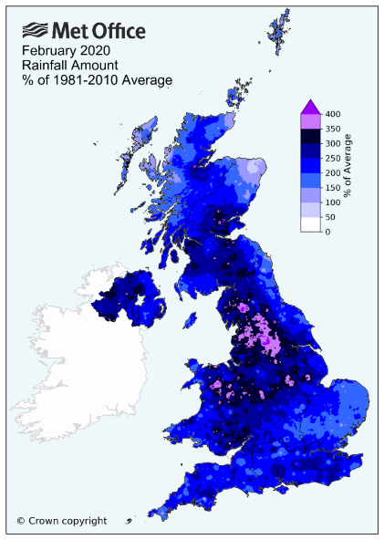
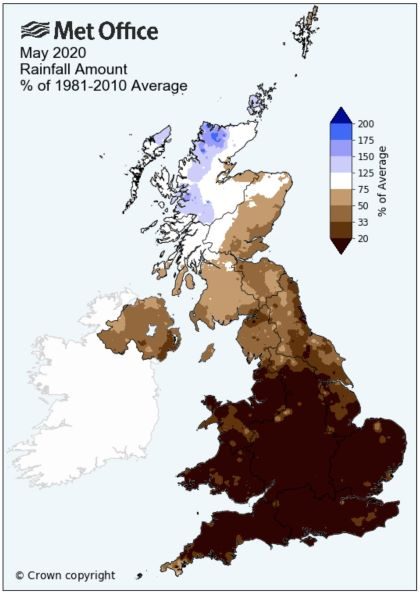
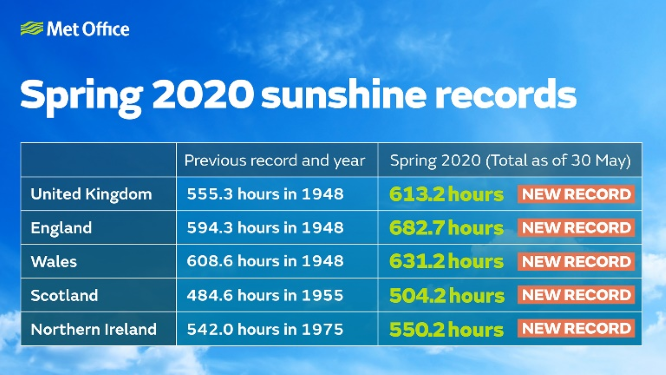
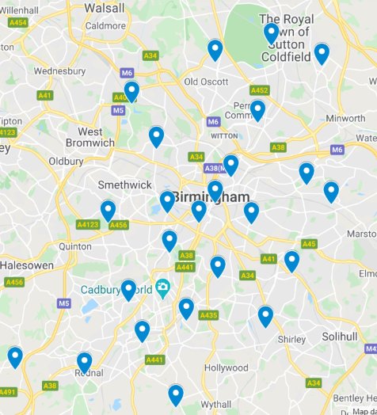

As mentioned in a previous blog found [here](./check-weather-in-your-region) the Urban Observatory at the University of Birmingham are working alongside Campbell Scientific to install brand new ClimaVUE50 weather stations fitted at numerous locations across Birmingham. These stations measure a number of meteorological features from average temperature to relative humidity, rainfall to wind speed and much more. With 19 stations previously fitted we are now lucky enough to have another 5 to add to our collection!

With 2020 so far breaking a number of UK weather related records – from the wettest February ever recorded to the sunniest spring since records began – it is evident that we must continue to monitor the weather all across the UK. Monitoring these weather extremes can help us prepare for a number of situations such as flooding, increased hospital admissions and even changing shopping habits. 

Although it is important to look at the big picture, it is also vital to monitor more regional and local weather. This brings us to the new stations we now have in Birmingham. To view their data please click the following links below:

Archbishop Ilsley:
https://app.konectgds.com/kiosk/db5dc2c6-28f3-4426-874f-bbe5a3206bba

Northfield Manor:
https://app.konectgds.com/kiosk/764aa21a-e15f-48ab-9f1f-7b8be477ab25

Rookery Road:
https://app.konectgds.com/kiosk/3d3d4536-8ee0-42c3-9c75-9388ed0a5579

ThinkTank:
https://app.konectgds.com/kiosk/ea8831d1-162c-48a6-9cca-49f43cd860d3

Warley Woods:
https://app.konectgds.com/kiosk/93326d3f-089a-4fa2-bc37-fb22506f8eec

The following map now displays all of the current 24 locations for our weather stations giving us amazing coverage across Birmingham.

Using the data from these stations, plus other sensors currently being installed across Birmingham, we will have both historical records and real-time data recorded for a number of environmental aspects all across the city. Essentially we are creating our own Urban Observatory!
