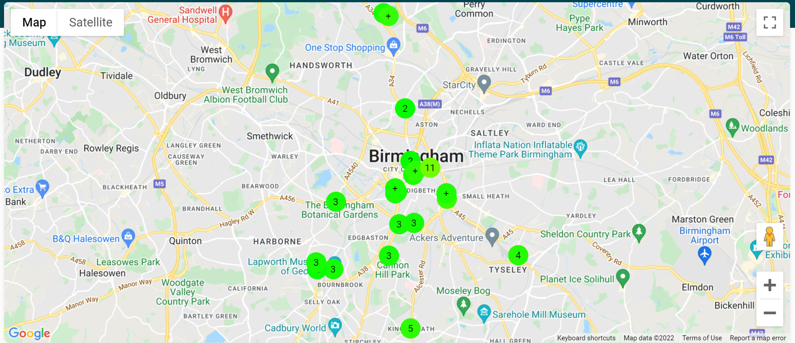
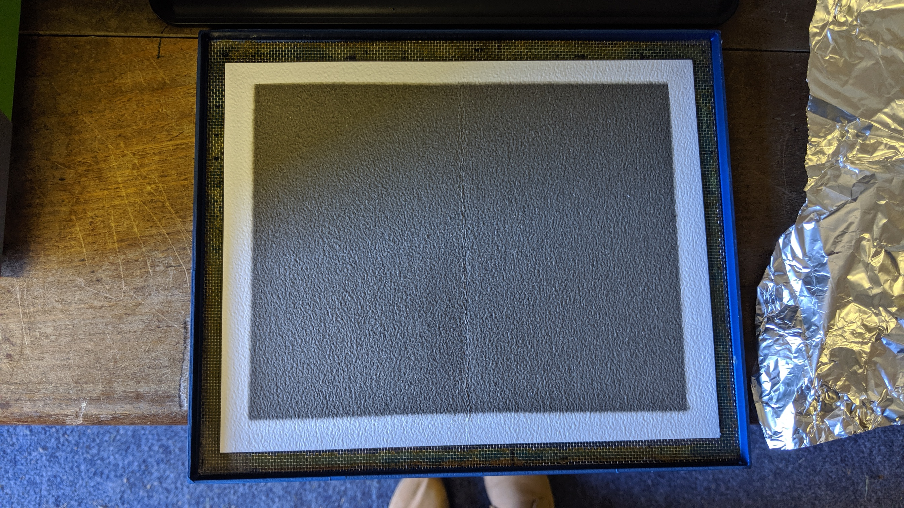

#Particulate matter- what is it and why is it important?

On our data hub you’ll see a number of our indicative air quality sensors recording particulate matter concentrations- but what is particulate matter and why is it so important to monitor?

#What is particulate matter?

Particulate matter refers to suspended particles in that float in the air. These particles can be of varying sizes. Most of our monitors report PM1, PM2.5 and PM10. These refer to particles of diameter 1, 2.5 and 10 micrometers respectively. To put these sizes into perspective, a grain of sand is about 90 micrometers diameter and a single strand of hair is about 70micrometers, meaning that a PM2.5 particle is about 35 times smaller than a grain of sand!

#Where does it come from?

Particles can come from many different sources. Primary sources include sea salt, desert dust, combustion of solid-state fuels, minerals from quarrying and brake and tyre wear from vehicles. However, some particles form from chemical reactions in the atmosphere- these are known as secondary sources and include nitrates and sulphates. 

#What’s the problem?

Particles can have many health impacts. Whilst larger PM10 can irritate eyes, nose and throats, smaller particles have the ability to penetrate into the lungs and blood. People with existing conditions such as asthma are most likely to experience poor health due to particulates. Particulate pollution has also been linked to lung disease, heart conditions, low birth weight in babies, cognitive performance.

#What can you do to reduce your exposure?

Our sensors are part of ongoing efforts to learn more about particulate matter across the West Midlands region. You can avoid busy traffic routes when walking to limit your exposure to particulates. You can also reduce your emissions of particulates by partaking in active travel and not burning solid fuels unnecessarily such a recreational wood burners. 
