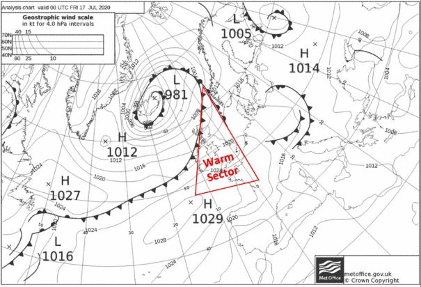
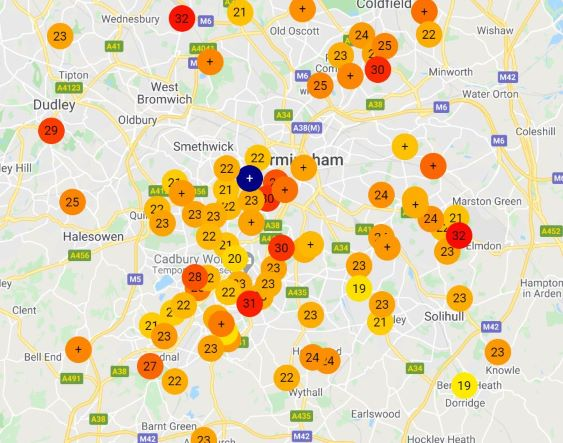

As you may know, an aspect of the Birmingham Urban Observatory has been the distribution of 100 citizen weather stations produced by a company named <a href=https://www.netatmo.com/en-gb/weather>Netatmo</a>. Using citizen weather stations allows us to collect a high density network of meteorological data at a much lower cost than a standard weather station. Although they may offer less accuracy than these, the high spatial coverage we can achieve by using them can allow us to see differences in the weather across differing areas of a city and can display effects such as the Urban Heat Island. 

#Netatmo weather stations
The Netatmo weather station consists of an indoor monitor, and outdoor monitor, an anemometer and a rain gauge. From these we can gather data for a number of features such as temperature, humidity, barometric pressure, wind speed and direction and precipitation rate. The different monitors can be seen below:

There is one slight problem with this equipment. The outdoor monitor, if situated in the sun, can produce inaccurate readings as it is heated up by the incoming solar radiation rather than simply measuring the ambient air temperature. Netatmo are aware of this pitfall and do suggest that the outdoor monitor is situated out of direct sunlight throughout the day. However, with limited space in citizen’s gardens, and with many weather enthusiasts being unaware of the issue, this can often be difficult to achieve. 

To counteract this overheating, we at Birmingham Urban Observatory use a custom made radiation shield to mimic a Stevenson screen. A Stevenson screen is the standard used within meteorological recording to house equipment sheltering it from direct radiation (sunlight), amongst other influences, whilst still allowing for air to pass through and circulate. Being white in colour and therefore having a high albedo (reflective property) also means that sunlight is reflected away from the instrumentation inside. Our custom made radiation shields act in a similar way, albeit they are much smaller as they are used just to house the Netatmo outdoor monitor.

#The build process

To build this, the Netatmo outdoor sensor can be removed from its casing as shown below:

The following equipment shown can then be used to build the radiation shield:

The Netatmo sensor is inserted into the middle of the shield:

Then once all 10 plates are added, plastic spacers are inserted and the bottom metal plate attachments are secured, we have the final product:

This completed radiation shield is now ready to be installed outside to begin making temperature observations.

#Case study

The benefits of our radiation shields can be seen with the current sensors situated across Birmingham. Here we demonstrate an example of this.

On Friday 17th we had a slight peak in temperatures as a warm front had passed over and we were situated within the warm sector of a low pressure system. We also has largely clear skies with lots of incoming solar radiation, something which as mentioned, can lead to inaccurate recordings if the unshielded Netatmo stations are located in direct sunlight. 

During this period there appeared to be large discrepancies between the Netatmo weather stations regarding the temperature across Birmingham. This led to a range from 20°C all the way up to the low 30’s.

When clicking on the different temperatures it was apparent that the lower temperatures were being recorded by the ‘Gatekeeper Netatmo’ – the monitors we distributed with the radiation shields – whilst the higher temperatures were being recorded by the ‘Public Netatmo’ – the monitors members of the public have installed themselves without a radiation shield. 

Our Elms cottage campus Meteorological station recorded a maximum temperature of 24.12°C on Friday 17th – indicating that the measurements recorded by Public Netatmo monitors in the high 20’s to low 30’s were most likely inaccurate readings 

Our custom made radiation shields may not be pretty or perfect, but they allow for us to get the improved readings from our citizen weather stations. 

Next time we have a clear, hot, sunny day why don’t you see if you are able to spot our Gatekeeper Netatmo weather stations on the Birmingham Urban Observatory <a href="https://data.birminghamurbanobservatory.com/map/platforms">data map?</a>

#Further reading

If you want more information on the use of radiation shields and Netatmo citizen weather stations then check out the following papers:

•	<a href="https://journals.ametsoc.org/jtech/article/31/4/938/68454/A-Low-Cost-Wireless-Temperature-Sensor-Evaluation">A Low-Cost Wireless Temperature Sensor: Evaluation for Use in Environmental Monitoring Applications (Young et al, 2014)</a>

•	<a href="https://rmets.onlinelibrary.wiley.com/doi/abs/10.1002/joc.4940">Can the crowdsourcing data paradigm take atmospheric science to a new level? A case study of the urban heat island of London quantified using Netatmo weather stations (Chapman et al, 2016)</a>

•	<a href="http://www.meteo.fr/icuc9/LongAbstracts/nomtm6-2-6171335_a.pdf">Challenges and benefits from crowdsourced atmospheric data for urban climate research using Berlin, Germany, as testbed (Meier et al, 2015)</a>

