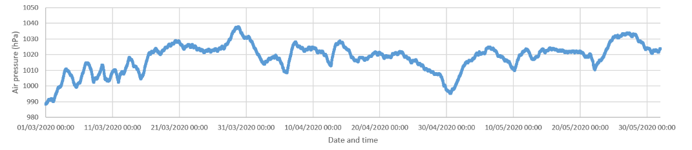
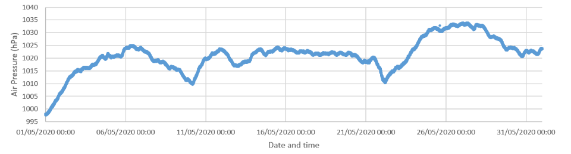
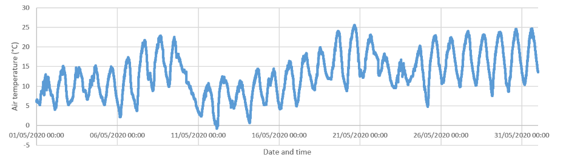
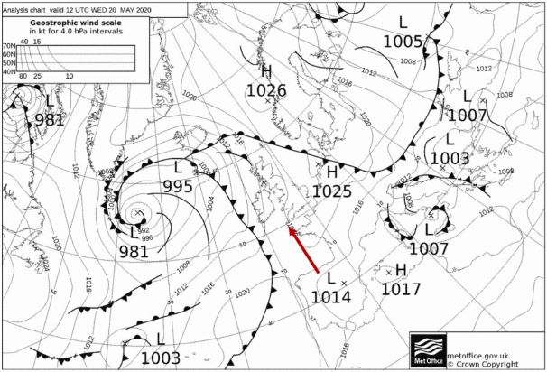
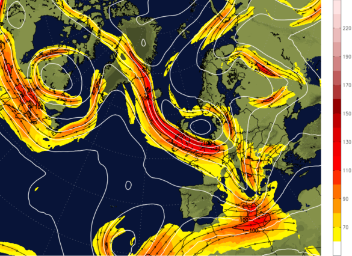

With a number of records already being broken so far this year for the UK (and we’re not even half way through yet!) our local weather stations allow us to take a look at what our meteorological situation has been like here in Birmingham. 
Considering the past few wet and windy days of June, the dry spell we experienced through May and much of spring may seem like a distant memory. However our Elms Cottage site on the University of Birmingham campus shows us that, similarly to much of the UK, we also experienced fine and dry weather conditions for the spring period. 

Spring showed consistently high pressure, particularly after the intense lows we had through February which had brought devastating flooding to parts of the region such as Shropshire and Worcestershire. 

This synoptic situation through May also had persistently high pressure leading to those clear, sunny days we were fortunate enough to have. 

Although this high pressure led to warm day time temperatures for Birmingham, we also had some cooler nights due to cloudless, clear skies. Elms Cottage even managed to record a minimum of -0.6°C on the morning of the 12th May. So we may have been donning our sunglasses and shorts for the afternoon but for some people making essential journeys in the morning will have led to some unexpected frost on their windscreens. 

The maximum temperature recorded for the month of May at our Elms site was 25.17°C at 16:38 on 20th May. The surface pressure charts for this day show that we were situated within a warm sector. High pressure also positioned to the east of the UK was allowing warm southerly air to spread northwards across the UK lifting the temperatures. 

However, with these warm temperatures also came very dry conditions. Our rain gauge only recorded 14 days of rain for the entire spring period in Birmingham and all of these dates fell within the first 3 weeks of March.

So far, June has been bringing us some wet and windy weather, very much needed for many UK reservoirs and gardens. This is due to a shift in the jet stream which has shifted position southwards to now be situated over the UK and is directing all the low pressure weather systems straight over us. 

We have had some incredible weather extremes so far this year and have seen several records broken. For much of June the weather still seems to look like a mixed bag of some warm days with showery outbreaks. Looking forward, who knows what the rest of the year will entail meteorologically for both the UK and Birmingham?
