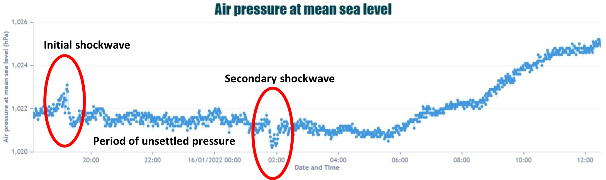
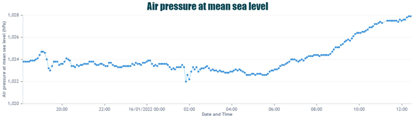

# Tonga eruption sensed on campus!
On Saturday 15th January, Tonga experienced an undersea volcanic eruption which caused not only local destruction but triggered tsunami warnings across the Pacific Ocean. Despite being over 10000 miles away, the Met Office reported shockwaves from the eruption being detected in the UK. Shockwaves from the eruption triggered abnormalities in air pressure as the waves travelled around the world, causing spikes in pressure as well as a period of unsettled pressure as the waves caused a “rippling” effect. 
The Birmingham Urban Observatory has a number of meteorological sensors, from reference grade to low-cost citizen science sensors which detected the shockwaves impact on air pressure, with the first shockwave being detected around 7pm on the 15th, followed by an unsettled period and a second wave at around 2am on the 16th Jan.  You can view the data on the Birmingham Urban Observatory website, alongside a wide array of meteorological and air quality data live streams.

