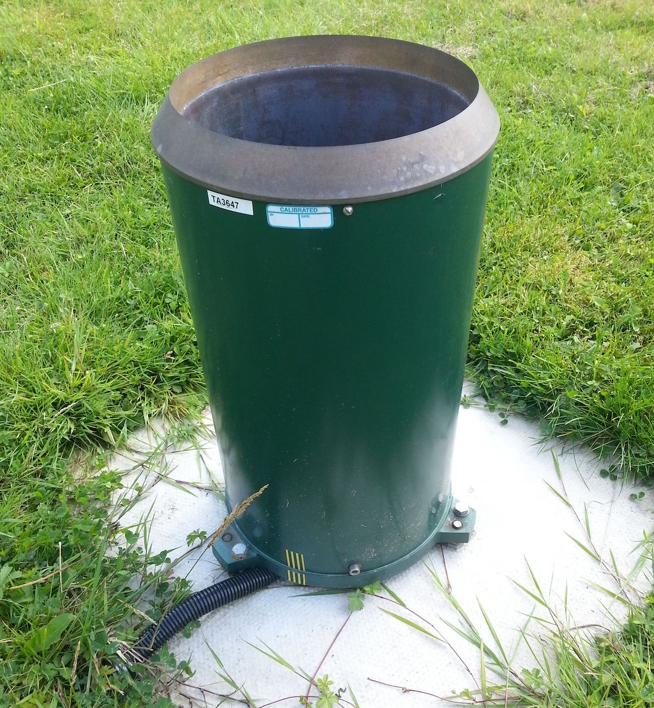
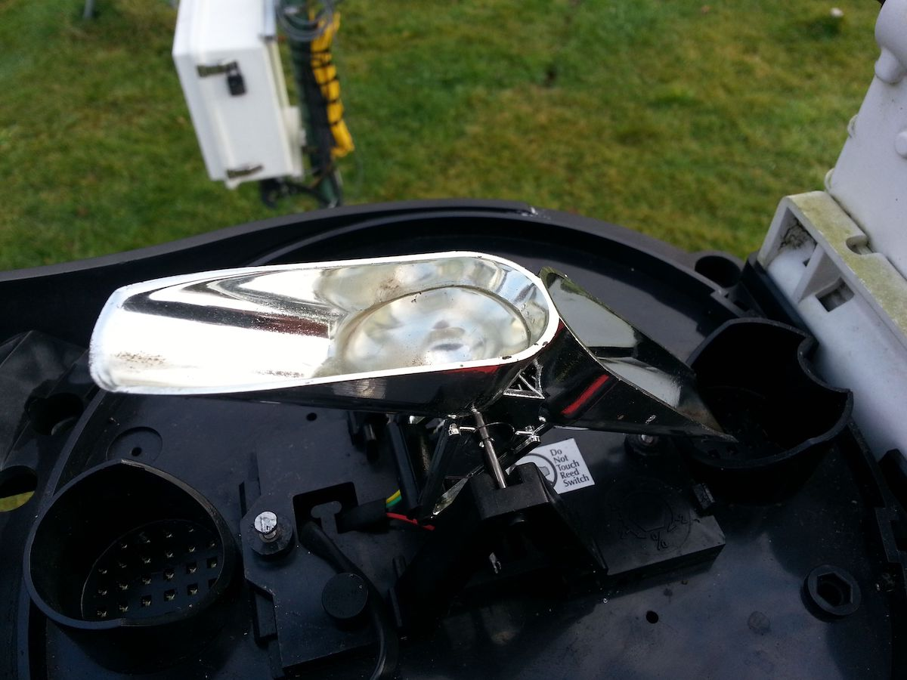

**The short answer**: The equivalent of 1 litre of rain falling over 1 square metre of ground.

**The long answer**:

If you've had a chance to check out our [data hub](https://data.birminghamurbanobservatory.com) you will notice that we like our weather stations. Many of these weather stations measure precipitation. You will commonly see two readings: a *precipitation depth* and a *precipitation rate*. Here's a quick explanation of each, and the units that we use.

# Precipitation depth

Precipitation can be measured in many different ways. Many automatic rain gauges (such as the one pictured below) use a tipping bucket system.

Precipitation falls into the gauge, where it is funnelled down such that it drips onto the tipping bucket system (see picture below). When the bucket becomes full enough it tips triggering an electronic reed switch that counts the tip. The weather station's software knows how much water it usually takes to trigger a tip. Using this volume of water and the surface area of rain gauge's opening it's possible to convert this to a *precipitation depth* in millimetres. 

For example, imagine a small circular rain gauge with a radius of 5.64 cm, this gives it a surface area of 100 cm². It's tipping buckets are calibrated such that they need to fill up with 1 ml of water before they tip. When they do tip the rain gauge registers a *precipitation depth* of 0.1 mm. This is because if you poured 1 ml of water (which would occupy 1 cubic centimetre) out into a dish with a surface area of 100 cm² the depth of the water would be just 0.1 mm.

Ok so what about a *precipitation depth* of **1 mm**? Well let's say the rain gauge in our previous example is subjected to a heavy downpour, it tips 10 times in the space of 10 minutes, and thus the *precipitation depth* over that 10 minute period is 1 mm (10 × 0.1 mm). If you imagine that the rain gauge wasn't there, and the rain was falling just as heavy everywhere in the vicinity, then assuming the ground was flat and impermeable there would be a 1 mm deep layer of water everywhere. 

If you had left a 1 metre wide square box out in the downpour then it would have the same 1 mm deep layer of water in it. If you poured this out you would have collected 1 litre of rain.

The key reason then for measuring precipitation as a depth in millimetres is that it cancels out the affect of the rain gauge size. Clearly a rain gauge that is 1 metre across will capture far more rain than one just 10 cm across, but both should output the same *precipitation depth* reading when subjected to the same downpour.

For further context, the *precipitation depth* over a whole month in the Midlands in typically around 50-80 mm. So if the daily total is above 10 mm it's most likely been a soggy day.

The reason we use the term *precipitation depth* rather than *rain depth* is that our rain gauges can also collect other forms of precipitation, e.g. snow and hail, which when they melt will also trigger the buckets to tip. The difficulty here is there will be a lag between when the precipitation fell and when it was registered, and from the readings alone it can be hard to distinguish between these different types. 

# Precipitation rate

Hopefully you now have a good idea of what *precipitation depth* is, so why do we need *precipitation rate* too? Well many weather stations upload readings at set intervals, e.g. every minute or every hour, and typically just submit the total *precipitation depth* over this whole period. You'd therefore imagine that the *precipitation depth* recorded over a minute would be far less than that collected over an hour. This becomes an issue if you want to compare weather stations that upload at different intervals. Calculating the *precipitation rate*, typically given in *millimetres per hour* (mm/h) helps with this.

As an example, a weather station might upload readings every 10 minutes. Over the last 10 minutes it collected 0.1 mm of rainfall, therefore the *precipitation rate* would be 0.6 mm/h. I.e. if the rain continues to fall at this rate then 0.6 mm of rain would fall over the hour. Of course the intensity of rainfall can change rapidly, so the actual amount collected over the hour may vary.

N.b. measuring rainfall is not without its difficulties. Rain gauges can become clogged with leaves and other debris, high winds can cause under-catch, and droplets can evaporate before they reach the buckets. However, these challenges are for a another blog post...

