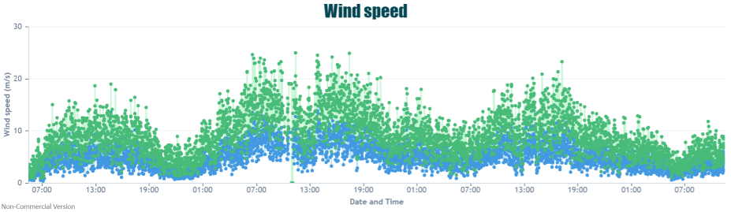
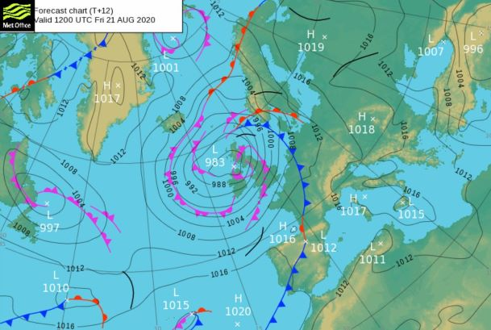
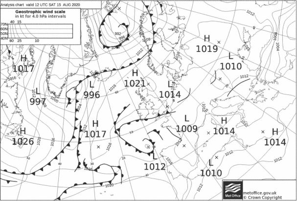
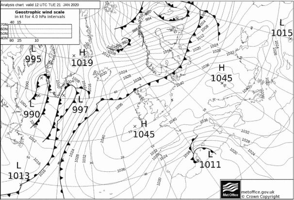
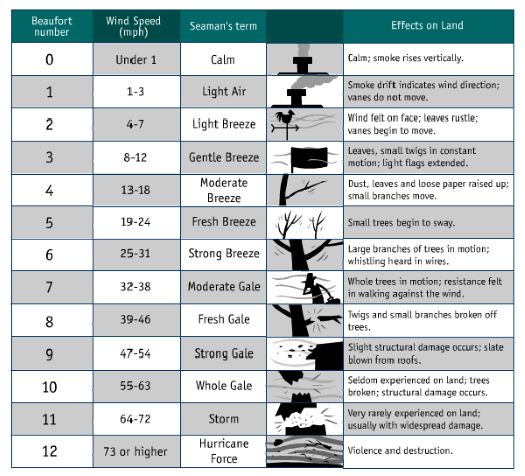

With the gusty weather we have had over the weekend I am sure many of you experienced the blustery winds. But what is wind? And how can we identify or measure it? 

#How is wind formed?

Winds develop all over the world and are part of the intrinsic system which forms our weather. There are many different types of winds from gentle sea breezes to stronger, hugely damaging Derecho winds. However, essentially they are all formed from the same process. 

As the sun heats up different parts of the earth and the atmosphere unequally, air will both expand and rise as it warms or contract and sink as it cools, depending on its surroundings. This causes the air to move around the globe – essentially creating wind. Many things can affect the movement and strength of the wind, from the presence of water to mountains and topographic changes. 

In the UK we are predominantly dominated by the westerlies – a band of wind which is found around the 30-60 degree latitude. Its name is derived from the fact that it originates from the west and travels eastwards and it is the reason why much of the UK weather is affected by low pressure moving in from the Atlantic Ocean. 

#How can we forecast wind?

You will often hear meteorologists on the television telling you that the close isobars will mean strong winds and this is true. When the isobars are close it is indicating a large difference in pressure across a small area, similarly to what we experienced late last week. 

However, when the isobars are far apart, we have very still and calm weather which can occur in summer and winter. Here are two examples from the recent August heatwave of 2020 to a calm, cold day we had in January earlier this year. In both of them you can the isobars are very spread out across the UK. 

#Wind measurements

Winds are categorised using the Beaufort Scale which ranges from still, calm winds to Hurricane force level. 

For Birmingham we are fairly lucky due to our sheltered position in the centre of England. However, as seen over the weekend we can still experience strong winds as low pressure passes over. 

Wind is measured using an anemometer. There are several different types of these ranging from cheap cup anemometers to more expensive sonic anemometers. 

Here at the Urban Observatory in Birmingham we have installed over a hundred sonic anemometers. Both our ClimaVUE stations and Netatmo wind anemometers record wind speed and direction with a great coverage across the city. To keep updated on wind speeds in Birmingham check out our [data map](https://birminghamurbanobservatory.com/). 

